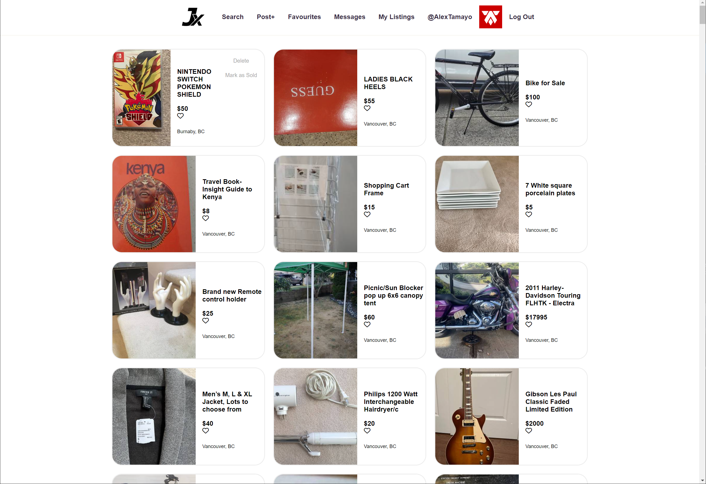
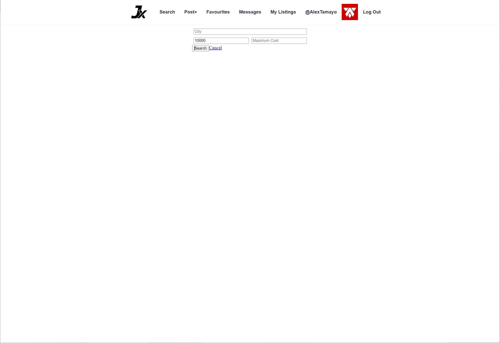
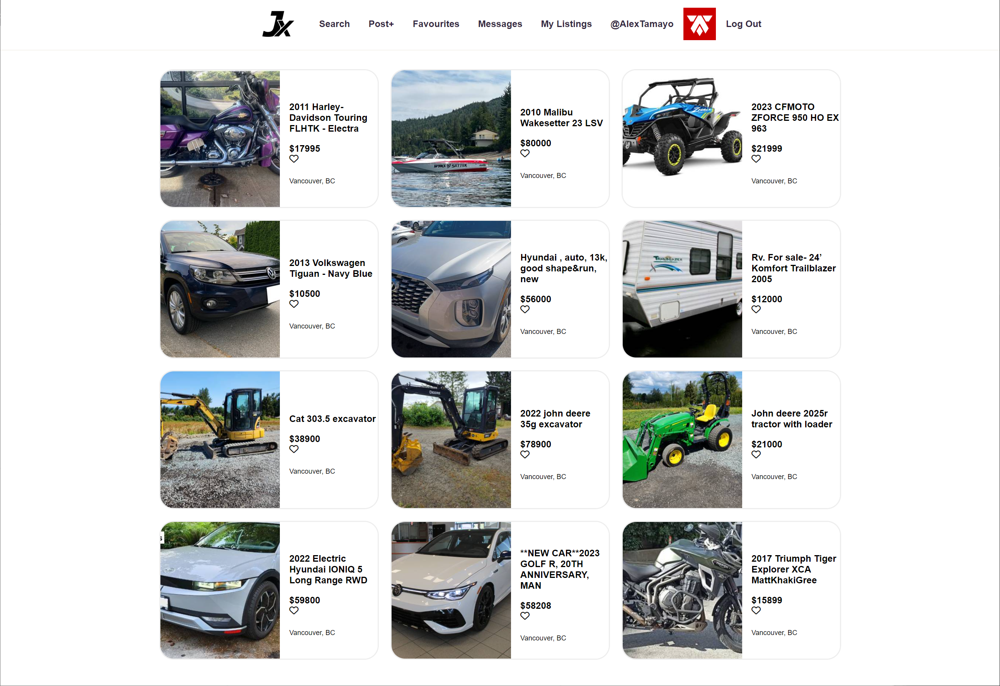
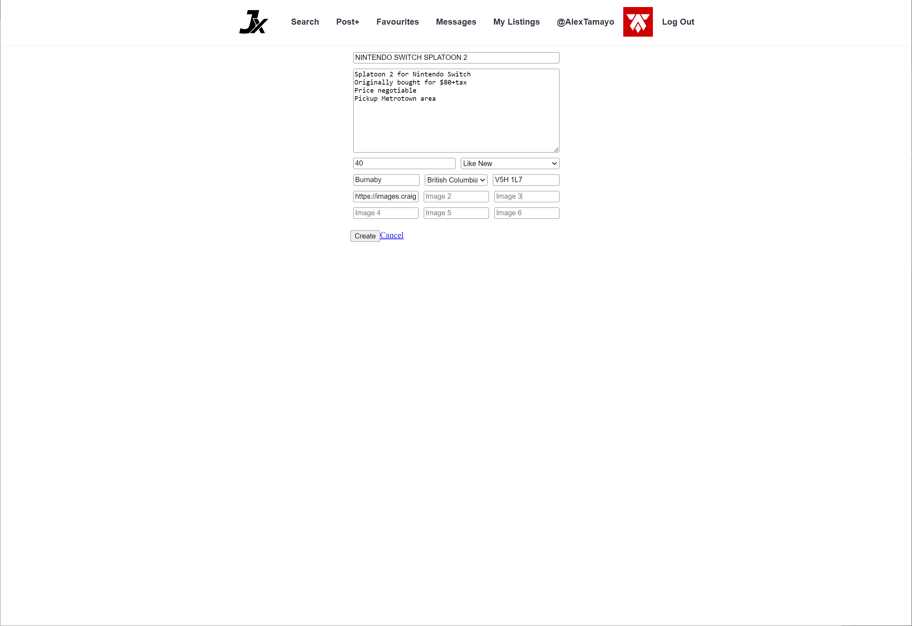
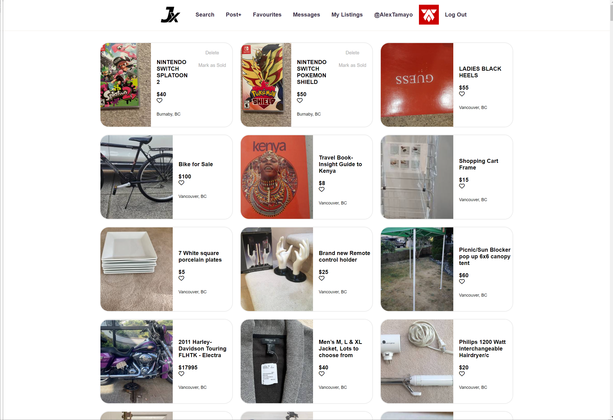

# JX: A Modern Product Listing Platform

Welcome to JX, your one-stop solution for a modern, intuitive product listing experience. This project serves as a midterm project for Lighthouse Labs and aims to reimagine the traditional classified ad websites, offering a slick user interface and enhanced functionalities. If you're familiar with platforms like Craigslist, imagine that but with a touch of modernity and user-friendliness.

## Features

- **User Authentication**: Secure login and registration features.
- **Dynamic Search**: Real-time search and filter options for an enhanced user experience.
- **Interactive UI**: A modern and clean interface built for simplicity and efficiency.
- **CRUD Operations**: Full Create, Read, Update, and Delete functionalities for listings.
- **User Profiles**: Personalized user profiles to manage listings and preferences.

## Tech Stack

- Frontend: HTML, CSS, JavaScript, jQuery
- Backend: Node.js, Express
- Database: PostgreSQL


## Media

### Home


### Search 1


### Search 2


### Post 1


### 



## Quick Start

1. Clone the repository:  
   ```bash
   git clone git@github.com:AlexTamayo/JX.git
   ```
2. Install dependencies:
   ```bash
   npm install
   ```

3. Run the server:
   ```bash
   npm start
   ```

Now, navigate to http://localhost:8081/ in your web browser to start exploring JX!

## Project Setup

1. Create the `.env` by using `.env.example` as a reference: `cp .env.example .env`
2. Update the .env file with your correct local information 
  - username: `labber` 
  - password: `labber` 
  - database: `midterm`
3. Install dependencies: `npm i`
4. Fix to binaries for sass: `npm rebuild node-sass`
5. Reset database: `npm run db:reset`
  - Check the db folder to see what gets created and seeded in the SDB
7. Run the server: `npm run local`
  - Note: nodemon is used, so you should not have to restart your server
8. Visit `http://localhost:8081/`

## Warnings & Tips

- Do not edit the `layout.css` file directly, it is auto-generated by `layout.scss`.
- Split routes into their own resource-based file names, as demonstrated with `users.js` and `widgets.js`.
- Split database schema (table definitions) and seeds (inserts) into separate files, one per table. See `db` folder for pre-populated examples.
- Use helper functions to run your SQL queries and clean up any data coming back from the database. See `db/queries` for pre-populated examples.
- Use the `npm run db:reset` command each time there is a change to the database schema or seeds.
  - It runs through each of the files, in order, and executes them against the database.
  - Note: you will lose all newly created (test) data each time this is run, since the schema files will tend to `DROP` the tables and recreate them.


  ## Dependencies

- Node 10.x or above
- NPM 5.x or above
- PG 6.x
